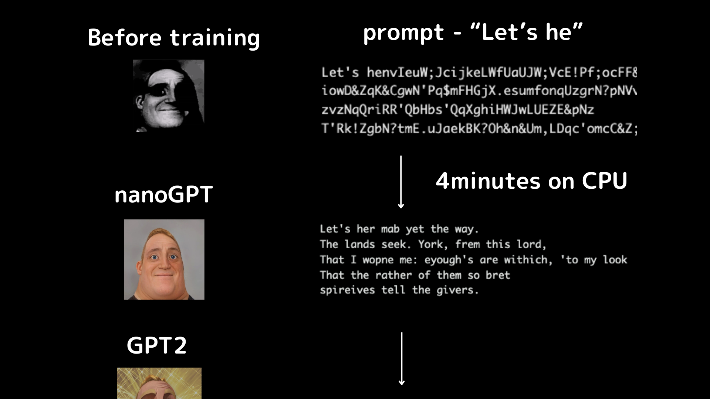
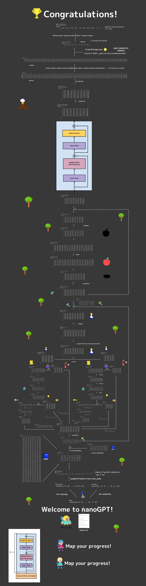
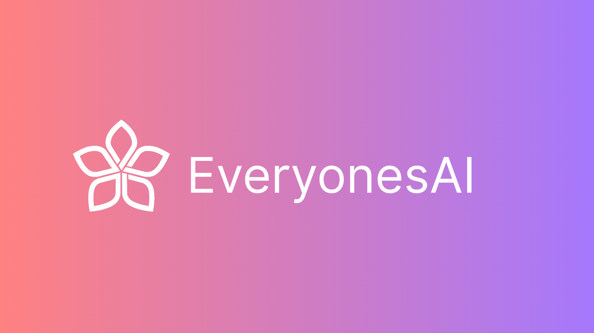
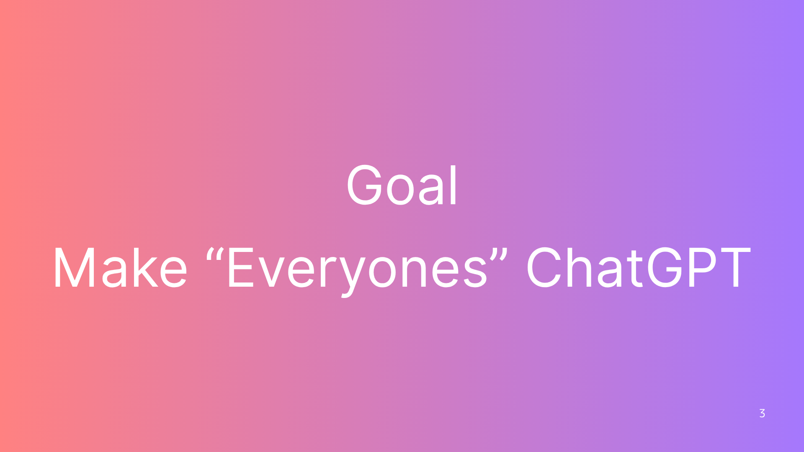
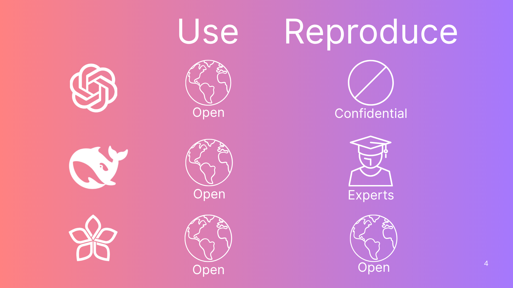
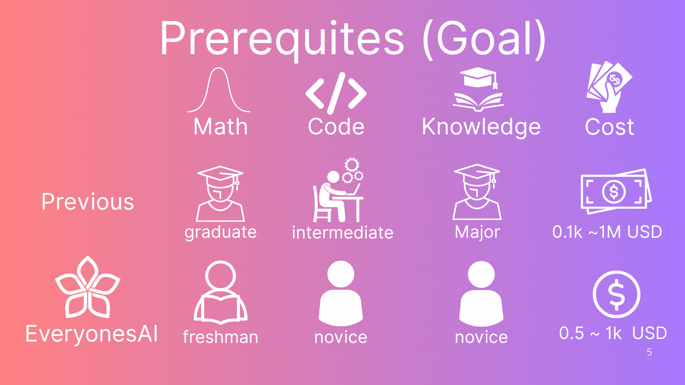
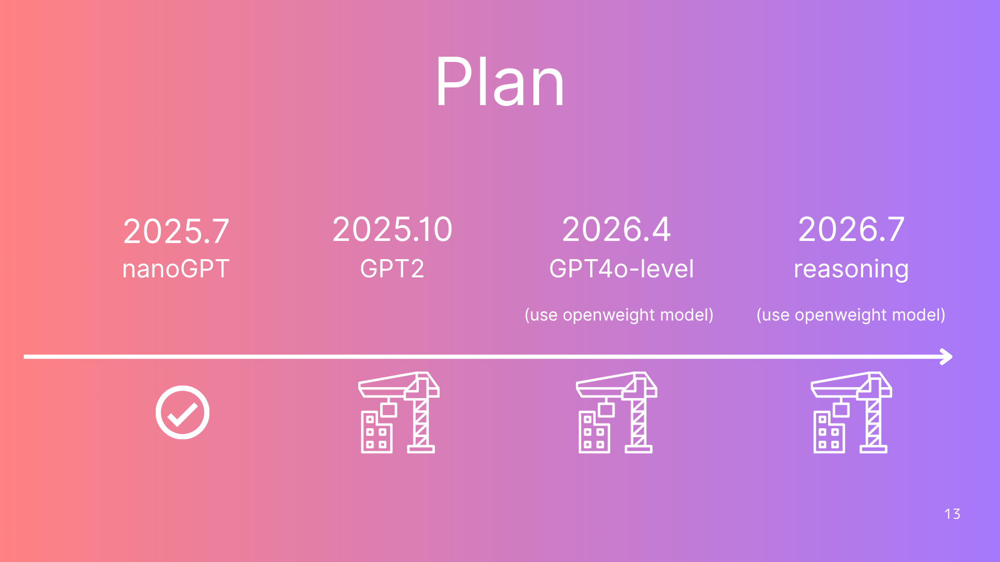

# **Everyones_nanoGPT fill-in-the-blank notebook Tutorial**

🌐 Select Language /
 [日本語](https://github.com/HayatoHongo/Everyones_nanoGPT/tree/ja) |
 [中文](https://github.com/HayatoHongo/Everyones_nanoGPT/tree/ch) /
 [বাংলা](https://github.com/HayatoHongo/Everyones_nanoGPT/tree/bn) |
[Others](README.otherlanguages.md)

 

> This is a complete guide for those who love ChatGPT and want to build their own. 
> You type "Hello," and it replies, "How can I help you today?" 
> When you realize this runs on simple math, your heart races. You cannot sleep. 
> Welcome to deep learning. There is no way back. 
> I wrote this guide on the train to school, squeezed into a tiny seat on the Nanboku Line. 
> Every time I read an excited comment from a student, 
> I feel that those days in that tiny seat had a big meaning.   

## **Demo output**

Let's make nano-GPT model!😎 
This tutorial gives you clear explanations and **over 100 fill-in-the-blank questions!🫨**  
Perfect for ealry birds who want to change their interests into real growth. 
If you meet the prerequisites, you can finish in 12–18 hours. 
Everything runs in Google Colab. This tutorial is based on [Andrej Karpathy’s nano-GPT](https://colab.research.google.com/drive/1JMLa53HDuA-i7ZBmqV7ZnA3c_fvtXnx-?usp=sharing).  
I'd like to express my deepest gratitude for his work.

## Table of Contents
You can translate the notebooks to almost any language on earth with this [notebook translator.](README.otherlanguages.md) 
I couldn’t translate the images with the tool, and I’d really appreciate your help translating the [images](https://www.canva.com/design/DAGw0J7yCsE/xdcjITCHd02iLSUMw8wlXA/edit?utm_content=DAGw0J7yCsE&utm_campaign=designshare&utm_medium=link2&utm_source=sharebutton). 

🌐 Select Language /
 [日本語](https://github.com/HayatoHongo/Everyones_nanoGPT/tree/ja) |
 [中文](https://github.com/HayatoHongo/Everyones_nanoGPT/tree/ch) /
 [বাংলা](https://github.com/HayatoHongo/Everyones_nanoGPT/tree/bn) |
[Others](README.otherlanguages.md)

| Chapter  | Estimated Time | English 🇺🇸 |
|---|---|---|
| Chapter 00: Start Tutorial      | 1-2 hour    |  |
| Chapter 01: Dataloader         | 1-2 hour    |  |
| Chapter 02: TokenEmbedding     | 0.5-1 hour  |  |
| Chapter 03: PositionEmbedding  | 0.5-1 hour  |  |
| Chapter 04: EmbeddingModule    | 0.5-1 hour  |  |
| Chapter 05: LayerNorm          | 1-2 hour    |  |
| Chapter 06: AttentionHead      | 3-4 hour    |  |
| Chapter 07: MultiHeadAttention | 1-2 hour    |  |
| Chapter 08: FeedForward        | 1-2 hour    |  |
| Chapter 09: TransformerBlock   | 0.5-1 hour  |  |
| Chapter 10: VocabularyLogits   | 0.5-1 hour  |  |
| Chapter 11: BigramLanguageModel| 1-2 hour    |  |
| Chapter 12: Trainer            | 1-2 hour    |  |

## **Tensor Map**
**You must create the following Tensor Map by yourself!** There are plenty of hints, so don't worry. 
[View the full-resolution Tensor Map of nanoGPT model on Canva.](https://www.canva.com/design/DAGskS8QP6k/1zs7IklaMrB_LncHn2I8pA/edit?utm_content=DAGskS8QP6k&utm_campaign=designshare&utm_medium=link2&utm_source=sharebutton) 

## **Prerequisites**

**Understanding**  
- Understand matrix multiplication and addition  
- Understand mean and variance  
- Understand ResNet’s residual connections  
- Understand Word2Vector  
   
   

**Experience**  
- Have built an MNIST digit recognition model using Pytorch’s.
- Have used cross-entropy as a loss function in digit recognition models like the above  
- Have implemented mini-batch processing and batch normalization  
- Have implemented an autoencoder or VAE

We are also working hard to release fun, entry-level tutorials for those who have never used PyTorch or programming by 2025.8.30.

## **Model**

It uses a bigram model, where each token is just one character.  
Also, the internal structure is very simple.   
The training text dataset is Shakespeare’s writings. Since they are very old, they are copyright-free. 

Compared to the real GPT-2, it’s quite basic. But start here to master the GPT basics.   
In just 2-4 minutes of CPU training (on a 16GB memory PC), you can generate Shakespeare-like text.  
It’s guaranteed to impress! 

## **Development Environment**

To keep setup simple, try running all examples in Google Colab. 

However, Google Colab doesn't save the checkbox marks. 
If you want to save your progress with checkbox marks, VS Code is a great choice.  
It’s also handy if you like to work in small bursts, such as 30 minutes at a time.  
In that case, fork and clone this repo to your own computer. 

Python 3.12 and PyTorch 2.6.0 work best, but most versions are fine.  
Usually, your installed PyTorch will just work. 
 If you hit issues, you can set up a virtual environment using `requirements.txt`. 
Or, if you use Docker Desktop, you can use the included `Dockerfile` and Dev Container extension for an even more stable setup.

## **About Project EveryonesAI**

